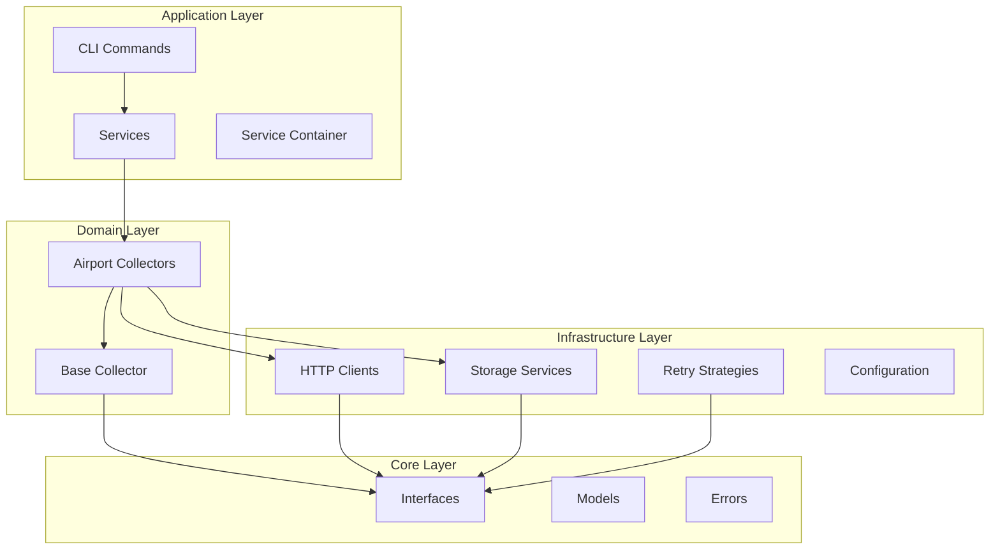
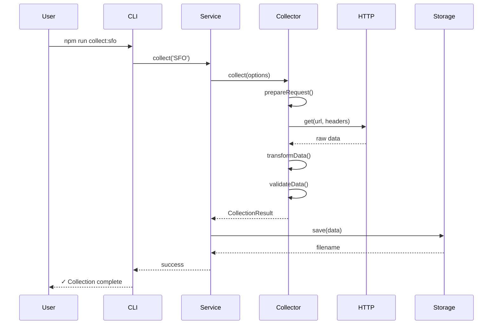
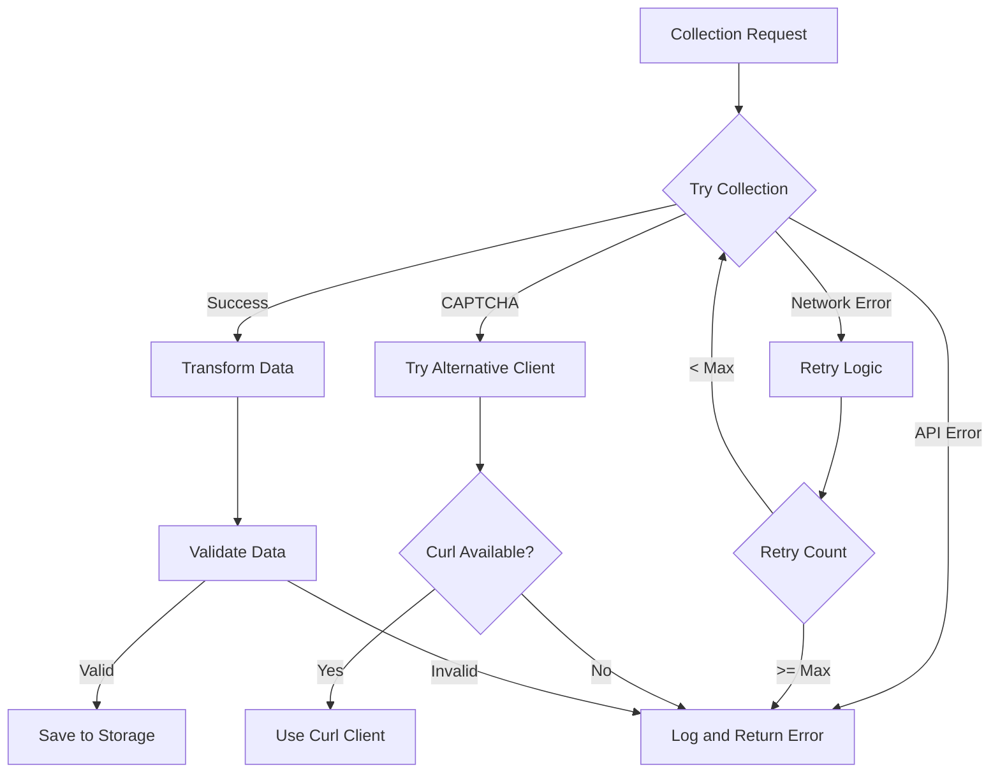

# Architecture & Design Documentation

## Table of Contents
- [System Overview](#system-overview)
- [SOLID Principles](#solid-principles)
- [Directory Structure](#directory-structure)
- [Core Components](#core-components)
- [Design Patterns](#design-patterns)
- [Data Flow](#data-flow)
- [API Reference](#api-reference)
- [Extension Points](#extension-points)

## System Overview

The Airport Flight Data Collector is built using clean architecture principles, separating concerns into distinct layers:



## SOLID Principles

### 1. Single Responsibility Principle (SRP)
Each class has one clear responsibility:

```javascript
// ✅ Good: Single responsibility
class NodeFetchClient {
  async get(url, headers) {
    // Only handles HTTP GET requests
  }
}

class LocalFileStorage {
  async save(data, airport, options) {
    // Only handles file storage
  }
}

// ❌ Bad: Multiple responsibilities
class AirportCollector {
  collectData() { }
  saveToFile() { }
  sendEmail() { }
  generateReport() { }
}
```

### 2. Open/Closed Principle (OCP)
Open for extension, closed for modification:

```javascript
// Base collector is closed for modification
class BaseAirportCollector {
  async collect(options) {
    // Template method pattern
    const request = await this.prepareRequest(options);
    const rawData = await this.fetchData(request);
    return await this.transformData(rawData);
  }
}

// But open for extension
class JFKCollector extends BaseAirportCollector {
  async prepareRequest(options) {
    // JFK-specific implementation
  }
}
```

### 3. Liskov Substitution Principle (LSP)
Derived classes can replace base classes:

```javascript
// Any storage service works the same way
const storage = getStorageService(); // LocalFileStorage or GitHubStorage
await storage.save(data, 'SFO');     // Works regardless of implementation
```

### 4. Interface Segregation Principle (ISP)
Focused interfaces for specific needs:

```javascript
// Separate interfaces for different concerns
interface IDataCollector {
  collect(options): Promise<CollectionResult>
  canHandle(options): Promise<boolean>
  getName(): string
}

interface IHttpClient {
  get(url, headers): Promise<any>
  post(url, data, headers): Promise<any>
}

interface IStorageService {
  save(data, airport, options): Promise<string>
  load(airport, date): Promise<any>
  exists(airport, date): Promise<boolean>
}
```

### 5. Dependency Inversion Principle (DIP)
Depend on abstractions, not concretions:

```javascript
class SFOCollector {
  constructor(
    httpClient: IHttpClient,      // Interface, not concrete class
    retryStrategy: IRetryStrategy,
    config: IConfiguration
  ) {
    this.httpClient = httpClient;
    this.retryStrategy = retryStrategy;
    this.config = config;
  }
}
```

## Directory Structure

```
src/
├── application/              # Application layer
│   ├── commands/            # CLI entry points
│   │   └── collect.js      # Main collection command
│   └── services/           # Application services
│       ├── CollectorService.js
│       └── ServiceContainer.js
│
├── core/                    # Core business logic
│   ├── interfaces/         # Abstract interfaces
│   │   ├── IDataCollector.js
│   │   ├── IHttpClient.js
│   │   ├── IStorageService.js
│   │   └── IRetryStrategy.js
│   ├── models/            # Domain models
│   │   ├── Flight.js
│   │   └── CollectionResult.js
│   └── errors/           # Custom errors
│       └── CollectionError.js
│
├── domain/                 # Domain-specific logic
│   └── collectors/        # Airport implementations
│       ├── BaseAirportCollector.js
│       ├── SFOCollector.js
│       ├── YYZCollector.js
│       └── YVRCollector.js
│
├── infrastructure/         # External dependencies
│   ├── http/             # HTTP implementations
│   │   ├── NodeFetchClient.js
│   │   ├── CurlClient.js
│   │   └── PuppeteerClient.js
│   ├── storage/          # Storage implementations
│   │   ├── LocalFileStorage.js
│   │   └── GitHubStorage.js
│   ├── retry/            # Retry implementations
│   │   └── ExponentialBackoffRetry.js
│   ├── logging/          # Logging utilities
│   │   └── Logger.js
│   └── config/           # Configuration
│       └── Configuration.js
│
└── legacy/                # Original implementation
    └── (preserved for compatibility)
```

## Core Components

### Interfaces

#### IDataCollector
The base interface for all data collectors:

```javascript
interface IDataCollector {
  /**
   * Collects data from the source
   * @param {CollectionOptions} options - Collection options
   * @returns {Promise<CollectionResult>} Collection result
   */
  collect(options: CollectionOptions): Promise<CollectionResult>
  
  /**
   * Checks if collector can handle the request
   * @param {CollectionOptions} options - Collection options  
   * @returns {Promise<boolean>} True if can handle
   */
  canHandle(options: CollectionOptions): Promise<boolean>
  
  /**
   * Gets the collector name
   * @returns {string} Collector name
   */
  getName(): string
}
```

#### IHttpClient
Interface for HTTP operations:

```javascript
interface IHttpClient {
  get(url: string, headers?: object): Promise<any>
  post(url: string, data: any, headers?: object): Promise<any>
  setDefaultHeaders(headers: object): void
}
```

#### IStorageService
Interface for data persistence:

```javascript
interface IStorageService {
  save(data: any, airport: string, options?: object): Promise<string>
  load(airport: string, date: string): Promise<any>
  exists(airport: string, date: string): Promise<boolean>
  list(airport: string, options?: object): Promise<string[]>
}
```

### Models

#### Flight Model
Represents a single flight:

```javascript
class Flight {
  constructor(data) {
    this.id = data.id;
    this.flightNumber = data.flightNumber;
    this.airline = {
      code: data.airlineCode,
      name: data.airlineName
    };
    this.origin = data.origin;
    this.destination = data.destination;
    this.scheduledTime = data.scheduledTime;
    this.actualTime = data.actualTime;
    this.status = data.status;
    this.gate = data.gate;
    this.terminal = data.terminal;
    this.type = data.type; // 'arrival' | 'departure'
    this.aircraft = data.aircraft;
    this.metadata = data.metadata || {};
  }
  
  isDelayed() {
    return this.actualTime > this.scheduledTime;
  }
  
  isCancelled() {
    return this.status === 'CANCELLED';
  }
  
  toJSON() {
    return { ...this };
  }
}
```

#### CollectionResult Model
Represents the result of a collection operation:

```javascript
class CollectionResult {
  constructor(success, data = null, error = null, metadata = {}) {
    this.success = success;
    this.data = data;
    this.error = error;
    this.metadata = metadata;
    this.timestamp = new Date().toISOString();
  }
  
  isSuccess() {
    return this.success === true;
  }
  
  isFailure() {
    return this.success === false;
  }
  
  static success(data, metadata = {}) {
    return new CollectionResult(true, data, null, metadata);
  }
  
  static failure(error, metadata = {}) {
    return new CollectionResult(false, null, error, metadata);
  }
}
```

### Airport Collectors

#### BaseAirportCollector
Template for all airport collectors:

```javascript
class BaseAirportCollector {
  constructor(httpClient, retryStrategy, config) {
    this.httpClient = httpClient;
    this.retryStrategy = retryStrategy;
    this.config = config;
    this.logger = new Logger(this.getName());
  }
  
  async collect(options = {}) {
    try {
      // Step 1: Prepare request
      const request = await this.prepareRequest(options);
      
      // Step 2: Fetch data with retry
      const rawData = await this.retryStrategy.execute(
        () => this.fetchData(request)
      );
      
      // Step 3: Transform data
      const transformedData = await this.transformData(rawData, options);
      
      // Step 4: Validate
      await this.validateData(transformedData);
      
      return CollectionResult.success(transformedData, {
        airport: this.getAirportCode(),
        timestamp: new Date().toISOString()
      });
    } catch (error) {
      this.logger.error('Collection failed', error);
      return CollectionResult.failure(error);
    }
  }
  
  // Abstract methods to be implemented by subclasses
  getAirportCode() {
    throw new Error('Must implement getAirportCode');
  }
  
  async prepareRequest(options) {
    throw new Error('Must implement prepareRequest');
  }
  
  async transformData(rawData, options) {
    throw new Error('Must implement transformData');
  }
}
```

## Design Patterns

### 1. Template Method Pattern
Used in `BaseAirportCollector` to define the collection algorithm:

```javascript
// Algorithm defined in base class
async collect(options) {
  const request = await this.prepareRequest(options);    // Step 1
  const rawData = await this.fetchData(request);         // Step 2
  const transformed = await this.transformData(rawData); // Step 3
  return this.createResult(transformed);                 // Step 4
}

// Steps implemented in subclasses
class SFOCollector extends BaseAirportCollector {
  async prepareRequest(options) {
    // SFO-specific request preparation
  }
}
```

### 2. Strategy Pattern
Used for HTTP clients and retry strategies:

```javascript
// Different strategies for HTTP requests
const httpStrategies = {
  fetch: new NodeFetchClient(),
  curl: new CurlClient(),
  puppeteer: new PuppeteerClient()
};

// Select strategy based on configuration
const httpClient = httpStrategies[config.httpClientType];
```

### 3. Factory Pattern
Service container acts as a factory:

```javascript
class ServiceContainer {
  static createDefault() {
    const container = new ServiceContainer();
    
    // Register services
    container.register('httpClient', () => {
      const type = process.env.HTTP_CLIENT_TYPE || 'fetch';
      return type === 'curl' ? new CurlClient() : new NodeFetchClient();
    });
    
    return container;
  }
}
```

### 4. Dependency Injection
All dependencies are injected through constructors:

```javascript
// Dependencies injected, not created
const collector = new SFOCollector(
  httpClient,      // Injected
  retryStrategy,   // Injected
  configuration    // Injected
);
```

### 5. Repository Pattern
Storage services abstract data persistence:

```javascript
// Repository interface hides storage details
const storage = new LocalFileStorage();
await storage.save(flightData, 'SFO');

// Can swap to different storage
const storage = new GitHubStorage();
await storage.save(flightData, 'SFO'); // Same interface
```

## Data Flow

### Collection Flow



### Error Handling Flow



## API Reference

### Collector API

#### SFOCollector
```javascript
const collector = new SFOCollector(httpClient, retryStrategy, config);

// Collect data
const result = await collector.collect({
  date: '2025-07-24',    // Optional, defaults to yesterday
  filterByDate: true,    // Filter results by date
  isTest: false         // Test mode flag
});

// Check result
if (result.isSuccess()) {
  console.log('Flights collected:', result.data.length);
} else {
  console.error('Collection failed:', result.error);
}
```

#### YYZCollector
```javascript
const collector = new YYZCollector(httpClient, retryStrategy, config);

// Collect with options
const result = await collector.collect({
  date: '2025-07-25',           // Optional, defaults to today
  delayBetweenRequests: 15000,  // Delay between API calls
  types: ['arrivals', 'departures'] // Which types to collect
});
```

#### YVRCollector
```javascript
const collector = new YVRCollector(httpClient, retryStrategy, config);

// YVR uses Puppeteer for Cloudflare bypass
const result = await collector.collect({
  date: '2025-07-25',
  headless: true,      // Run browser in headless mode
  timeout: 30000       // Browser timeout
});
```

### Storage API

#### LocalFileStorage
```javascript
const storage = new LocalFileStorage('data');

// Save data
const filename = await storage.save(
  flightData,
  'SFO',
  { isTest: false }
);

// Load data
const data = await storage.load('SFO', '2025-07-24');

// Check existence
const exists = await storage.exists('SFO', '2025-07-24');

// List files
const files = await storage.list('SFO', {
  startDate: '2025-07-01',
  endDate: '2025-07-31'
});
```

#### GitHubStorage
```javascript
const storage = new GitHubStorage(token, repository, basePath);

// Save with commit message
const filename = await storage.save(
  flightData,
  'YYZ',
  { 
    type: 'arrivals',
    message: 'Add YYZ arrivals data'
  }
);
```

### HTTP Client API

#### NodeFetchClient
```javascript
const client = new NodeFetchClient();

// Set default headers
client.setDefaultHeaders({
  'User-Agent': 'Mozilla/5.0...'
});

// Make request
const data = await client.get(url, {
  'Accept': 'application/json'
});
```

#### CurlClient
```javascript
const client = new CurlClient();

// Curl client handles bot protection better
const data = await client.get(url, headers);
```

#### PuppeteerClient
```javascript
const client = new PuppeteerClient({
  headless: true,
  args: ['--no-sandbox']
});

// Browser-based request for heavy protection
const data = await client.get(url);
```

## Extension Points

### Adding a New Airport

1. Create a new collector class:

```javascript
// src/domain/collectors/LAXCollector.js
const BaseAirportCollector = require('./BaseAirportCollector');

class LAXCollector extends BaseAirportCollector {
  getAirportCode() {
    return 'LAX';
  }
  
  async prepareRequest(options) {
    const date = options.date || this.getDefaultDate();
    return {
      url: `https://api.lax.com/flights?date=${date}`,
      headers: {
        'Accept': 'application/json',
        'API-Key': this.config.get('airports.lax.apiKey')
      }
    };
  }
  
  async transformData(rawData, options) {
    return {
      airport: 'LAX',
      date: options.date,
      flights: rawData.flights.map(flight => ({
        id: flight.flightId,
        flightNumber: flight.number,
        airline: flight.carrier,
        // ... map other fields
      }))
    };
  }
  
  async validateData(data) {
    if (!data.flights || !Array.isArray(data.flights)) {
      throw new ValidationError('Invalid flight data structure');
    }
  }
}

module.exports = LAXCollector;
```

2. Register in service container:

```javascript
// src/application/services/ServiceContainer.js
container.register('laxCollector', (c) => {
  return new LAXCollector(
    c.get('httpClient'),
    c.get('retryStrategy'),
    c.get('config')
  );
});

// Add to collectors array
container.register('collectors', (c) => {
  return [
    c.get('sfoCollector'),
    c.get('yyzCollector'),
    c.get('yvrCollector'),
    c.get('laxCollector')  // New collector
  ];
});
```

3. Add configuration:

```javascript
// src/infrastructure/config/Configuration.js
airports: {
  lax: {
    url: process.env.LAX_API_URL || 'https://api.lax.com/flights',
    apiKey: process.env.LAX_API_KEY
  }
}
```

### Adding a New Storage Backend

1. Implement the interface:

```javascript
// src/infrastructure/storage/S3Storage.js
const IStorageService = require('../../core/interfaces/IStorageService');
const AWS = require('aws-sdk');

class S3Storage extends IStorageService {
  constructor(bucket, region) {
    super();
    this.s3 = new AWS.S3({ region });
    this.bucket = bucket;
  }
  
  async save(data, airport, options = {}) {
    const key = this.generateKey(airport, options);
    const params = {
      Bucket: this.bucket,
      Key: key,
      Body: JSON.stringify(data, null, 2),
      ContentType: 'application/json'
    };
    
    await this.s3.putObject(params).promise();
    return key;
  }
  
  async load(airport, date) {
    const key = `${airport}/${airport}_flights_${date}.json`;
    const params = {
      Bucket: this.bucket,
      Key: key
    };
    
    const result = await this.s3.getObject(params).promise();
    return JSON.parse(result.Body.toString());
  }
  
  // Implement other methods...
}
```

2. Register in container:

```javascript
container.register('storageService', (c) => {
  const type = process.env.STORAGE_TYPE || 'local';
  
  switch (type) {
    case 's3':
      return new S3Storage(
        process.env.S3_BUCKET,
        process.env.S3_REGION
      );
    case 'github':
      return new GitHubStorage(/* ... */);
    default:
      return new LocalFileStorage(/* ... */);
  }
});
```

### Adding a New HTTP Client

1. Implement the interface:

```javascript
// src/infrastructure/http/AxiosClient.js
const IHttpClient = require('../../core/interfaces/IHttpClient');
const axios = require('axios');

class AxiosClient extends IHttpClient {
  constructor() {
    super();
    this.client = axios.create({
      timeout: 30000
    });
  }
  
  async get(url, headers = {}) {
    const response = await this.client.get(url, { headers });
    return response.data;
  }
  
  async post(url, data, headers = {}) {
    const response = await this.client.post(url, data, { headers });
    return response.data;
  }
  
  setDefaultHeaders(headers) {
    Object.assign(this.client.defaults.headers.common, headers);
  }
}
```

## Configuration Reference

### Environment Variables

```bash
# Core Settings
NODE_ENV=development|production
DB_PROVIDER=local|cloudflare|oci
DB_TABLE_PREFIX=airport_flight_data

# HTTP Client
HTTP_CLIENT_TYPE=fetch|curl|puppeteer
HTTP_TIMEOUT=30000
HTTP_USER_AGENT=Mozilla/5.0...

# Retry Strategy
RETRY_MAX_ATTEMPTS=3
RETRY_BASE_DELAY=1000
RETRY_MAX_DELAY=60000

# Storage
STORAGE_TYPE=local|github|s3
STORAGE_BASE_PATH=data
GITHUB_TOKEN=your-token
GITHUB_REPOSITORY=owner/repo

# Logging
VERBOSE=true|false
LOG_LEVEL=error|warn|info|debug
LOG_FILE=logs/collector.log

# Airport-specific
SFO_API_URL=https://custom-url
YYZ_DELAY_BETWEEN_REQUESTS=15000
YVR_USE_PUPPETEER=true
```

### Configuration Object

```javascript
const config = {
  environment: 'development',
  features: {
    verboseLogging: true,
    saveTestData: false,
    retryOnFailure: true
  },
  http: {
    clientType: 'fetch',
    timeout: 30000,
    userAgent: 'Mozilla/5.0...'
  },
  retry: {
    maxAttempts: 3,
    baseDelay: 1000,
    maxDelay: 60000,
    factor: 2
  },
  storage: {
    type: 'local',
    basePath: 'data',
    prettyPrint: true
  },
  airports: {
    sfo: {
      url: 'https://www.flysfo.com/api/flights',
      defaultOffset: -1 // Yesterday
    },
    yyz: {
      url: 'https://www.torontopearson.com/api/flights',
      delayBetweenRequests: 15000
    }
  }
};
```

## Performance Considerations

### Optimization Strategies

1. **Parallel Collection**
```javascript
// Collect from multiple airports concurrently
const results = await Promise.allSettled([
  sfoCollector.collect(),
  yyzCollector.collect(),
  yvrCollector.collect()
]);
```

2. **Connection Pooling**
```javascript
// Reuse HTTP connections
const httpClient = new NodeFetchClient({
  keepAlive: true,
  maxSockets: 10
});
```

3. **Caching**
```javascript
// Cache frequently accessed data
const cache = new Map();
const cachedData = cache.get(key) || await fetchData();
```

4. **Batch Operations**
```javascript
// Batch storage operations
const batchStorage = new BatchStorage();
await batchStorage.saveMultiple(flights);
```

### Monitoring

Add monitoring to track performance:

```javascript
class PerformanceMonitor {
  async measureCollection(collector) {
    const start = Date.now();
    const result = await collector.collect();
    const duration = Date.now() - start;
    
    this.metrics.record({
      collector: collector.getName(),
      duration,
      success: result.isSuccess(),
      recordCount: result.data?.length || 0
    });
    
    return result;
  }
}
```

## Security Considerations

### Best Practices

1. **Environment Variables**
   - Never commit `.env` files
   - Use secrets management in production
   - Rotate credentials regularly

2. **Input Validation**
   - Validate all external input
   - Sanitize data before storage
   - Use parameterized queries

3. **Error Handling**
   - Don't expose internal errors
   - Log security events
   - Implement rate limiting

4. **Network Security**
   - Use HTTPS for all requests
   - Validate SSL certificates
   - Implement request timeouts

### Example Security Implementation

```javascript
class SecureCollector extends BaseAirportCollector {
  async validateData(data) {
    // Validate structure
    if (!this.isValidStructure(data)) {
      throw new ValidationError('Invalid data structure');
    }
    
    // Sanitize strings
    data.flights = data.flights.map(flight => ({
      ...flight,
      flightNumber: this.sanitize(flight.flightNumber),
      airline: this.sanitize(flight.airline)
    }));
    
    // Check for suspicious patterns
    if (this.detectAnomalies(data)) {
      this.logger.warn('Anomalies detected in data');
    }
    
    return data;
  }
  
  sanitize(input) {
    return String(input)
      .replace(/[<>]/g, '')
      .trim()
      .substring(0, 100);
  }
}
```

## Testing Strategy

### Unit Tests
Test individual components:

```javascript
describe('SFOCollector', () => {
  it('should transform API data correctly', async () => {
    const collector = new SFOCollector(
      mockHttpClient,
      mockRetryStrategy,
      mockConfig
    );
    
    const rawData = { flights: [...] };
    const transformed = await collector.transformData(rawData);
    
    expect(transformed).toHaveProperty('airport', 'SFO');
    expect(transformed.flights).toHaveLength(rawData.flights.length);
  });
});
```

### Integration Tests
Test component interactions:

```javascript
describe('Collection Integration', () => {
  it('should collect and save data', async () => {
    const container = ServiceContainer.createDefault();
    const service = container.get('collectorService');
    
    const result = await service.collect('SFO');
    
    expect(result.isSuccess()).toBe(true);
    expect(result.data).toBeDefined();
  });
});
```

### End-to-End Tests
Test complete workflows:

```javascript
describe('E2E Collection', () => {
  it('should collect from all airports', async () => {
    const results = await runCommand('npm run collect:all');
    
    expect(results.exitCode).toBe(0);
    expect(results.output).toContain('Collection complete');
  });
});
```

## Troubleshooting

### Common Issues

1. **Module Resolution**
   ```bash
   Error: Cannot find module './SomeModule'
   ```
   - Check relative paths
   - Verify file exists
   - Check case sensitivity

2. **Async/Await Issues**
   ```javascript
   // Wrong
   const data = collector.collect(); // Missing await
   
   // Correct
   const data = await collector.collect();
   ```

3. **Dependency Injection**
   ```javascript
   // Wrong - creating dependencies
   class Collector {
     constructor() {
       this.http = new HttpClient(); // Bad
     }
   }
   
   // Correct - injecting dependencies
   class Collector {
     constructor(httpClient) {
       this.http = httpClient; // Good
     }
   }
   ```

## Contributing

### Adding Features

1. Follow SOLID principles
2. Write tests first (TDD)
3. Update documentation
4. Submit PR with description

### Code Style

- Use ES6+ features
- Async/await over promises
- Descriptive variable names
- JSDoc comments for public APIs

### Review Checklist

- [ ] Tests pass
- [ ] Documentation updated
- [ ] Follows architecture patterns
- [ ] No breaking changes
- [ ] Security considered