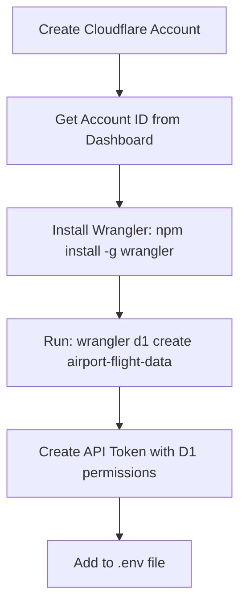
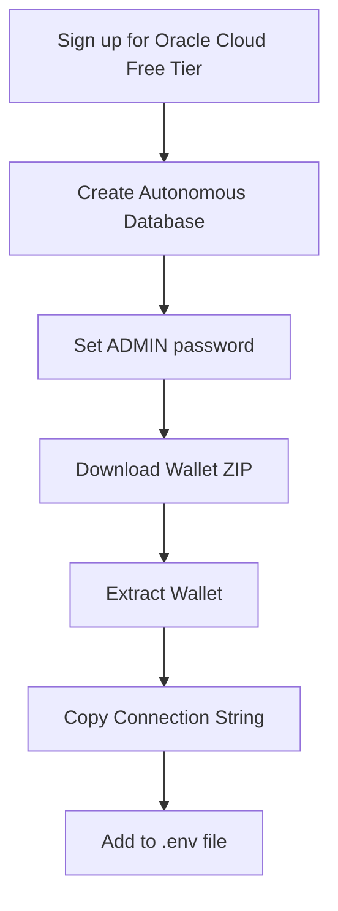

# Quick Credentials Setup

## 🚀 Fastest Path to Database Setup

### Option 1: Cloudflare D1 (Recommended for Beginners)
**Time: ~10 minutes**



#### Quick Commands:
```bash
# 1. Install Wrangler
npm install -g wrangler

# 2. Login
wrangler login

# 3. Create database
wrangler d1 create airport-flight-data

# 4. Copy the output database_id
```

#### Your .env:
```bash
DB_PROVIDER=cloudflare
CF_ACCOUNT_ID=              # From dashboard sidebar
CF_DATABASE_ID=             # From wrangler output
CF_API_TOKEN=               # From API tokens page
```

---

### Option 2: Oracle Cloud (Best Free Tier)
**Time: ~20 minutes**



#### Key Steps:
1. **Sign up**: https://oracle.com/cloud/free/
2. **Create DB**: Menu → Oracle Database → Autonomous Database → Create
3. **Download Wallet**: Database page → Database Connection → Download Wallet
4. **Extract**: `unzip Wallet_*.zip -d ~/oracle-wallet/`

#### Your .env:
```bash
DB_PROVIDER=oci
OCI_USER=ADMIN              # Default admin user
OCI_PASSWORD=               # Password you created
OCI_CONNECTION_STRING=      # From Database Connection page
OCI_WALLET_LOCATION=        # Path where you extracted wallet
OCI_WALLET_PASSWORD=        # Wallet password you created
```

---

## 📋 Credentials Checklist

### Cloudflare D1 ✓
- [ ] Cloudflare Account
- [ ] Account ID (from dashboard)
- [ ] Database ID (from wrangler)
- [ ] API Token (from tokens page)

### Oracle Cloud ✓
- [ ] Oracle Cloud Account
- [ ] Database ADMIN password
- [ ] Wallet ZIP downloaded
- [ ] Wallet password
- [ ] Connection string

---

## 🧪 Test Your Setup

```bash
# 1. Copy template
cp .env.template .env

# 2. Fill in your credentials

# 3. Test connection
node scripts/test-database.js
```

Success looks like:
```
✅ Connection successful!
✅ Health check passed!
   Status: healthy
   Environment: development
   Tables:
     - Flights: airport_flight_data_dev_flights
     - Status: airport_flight_data_dev_flight_status_history
```

---

## 🆘 Quick Fixes

### Cloudflare Issues

**"Authentication failed"**
```bash
# Regenerate token with correct permissions:
# Account → D1 → Edit
```

**"Database not found"**
```bash
# List your databases
wrangler d1 list

# Use the ID, not the name!
```

### Oracle Issues

**"Invalid username/password"**
- Password is case-sensitive
- Try: `YourPassword123!` (with special char)

**"Cannot find wallet"**
```bash
# Use absolute path
pwd  # Get current directory
# Then: /home/username/oracle-wallet
```

---

## 🎯 Which Should I Choose?

### Choose Cloudflare D1 if:
- ✅ You want the quickest setup
- ✅ You're already using Cloudflare
- ✅ You need global edge deployment
- ✅ Your data is under 5GB

### Choose Oracle Cloud if:
- ✅ You need more storage (20GB free)
- ✅ You want enterprise features
- ✅ You need better query performance
- ✅ You might scale beyond 5GB

---

## 🚦 Next Steps

1. **Test locally first**:
   ```bash
   npm test
   ```

2. **Migrate your data**:
   ```bash
   # For Cloudflare
   node scripts/migrate-to-cloudflare.js --recent-only
   
   # For Oracle
   node scripts/migrate-to-oci.js --recent-only
   ```

3. **Add to GitHub Secrets** for automated collection:
   - Go to Settings → Secrets → Actions
   - Add each credential as a secret
   - Use same names as .env

---

## 💡 Pro Tips

1. **Start with recent data only** to test faster:
   ```bash
   node scripts/migrate-to-cloudflare.js --recent-only
   ```

2. **Use development environment** first:
   ```bash
   NODE_ENV=development
   ```

3. **Monitor your usage**:
   ```bash
   node scripts/monitor.js --check-once
   ```

Need help? Check the [detailed guide](database-credentials-guide.md) or [open an issue](https://github.com/czhaoca/airport-flight-data-collector/issues)!