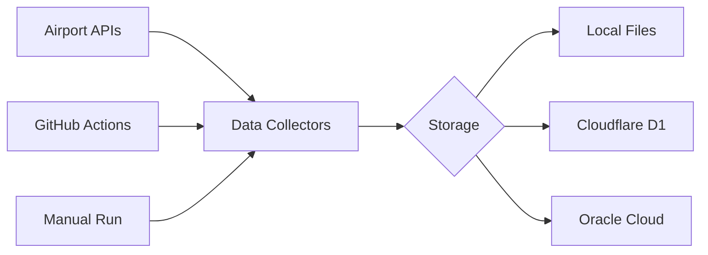

# Getting Started Guide

Welcome to the Airport Flight Data Collector! This guide will help you get up and running quickly.

## 🚀 Quick Start (5 minutes)

### 1. Prerequisites
- **Node.js 18+** ([Download](https://nodejs.org/))
- **Git** ([Download](https://git-scm.com/))
- **GitHub Account** (for automated collection)

### 2. Installation

```bash
# Clone the repository
git clone https://github.com/czhaoca/airport-flight-data-collector.git
cd airport-flight-data-collector

# Install dependencies
npm install

# Copy environment template
cp .env.template .env
```

### 3. First Run

```bash
# Test with local storage (no setup required!)
npm run test:sfo

# Check the data
ls data/SFO/
```

That's it! You've collected your first flight data. 🎉

## 📊 Understanding the Project

### What Does This Do?

This project automatically collects flight arrival and departure data from major airports:
- **San Francisco (SFO)** - Previous day's data
- **Toronto Pearson (YYZ)** - Current day's data  
- **Vancouver (YVR)** - Current day's data

The data is used for:
- Flight delay and cancellation pattern analysis
- Historical flight tracking
- Big data analytics projects
- Academic research

### How It Works



1. **Collectors** fetch data from airport APIs
2. **Storage adapters** save data to your chosen backend
3. **GitHub Actions** automate daily collection
4. **Analysis tools** help you explore the data

## 🎯 Common Use Cases

### Use Case 1: Local Development
Perfect for testing and development.

```bash
# Collect data locally
npm run collect:all

# View collected data
ls -la data/
```

### Use Case 2: Automated Collection
Set up GitHub Actions for daily collection.

```bash
# Fork the repository
# Enable GitHub Actions
# Add secrets (see database-setup.md)
# Data collects automatically!
```

### Use Case 3: Cloud Database Storage
For production use with query capabilities.

```bash
# Set up database (10-20 minutes)
# See database-setup.md for detailed steps

# Configure .env
DB_PROVIDER=cloudflare  # or oci

# Collect to database
npm run collect:all
```

## 🏗️ Architecture Overview

The project uses SOLID principles and clean architecture:

```
src/
├── application/       # Commands and services
├── core/             # Interfaces and models  
├── domain/           # Airport collectors
└── infrastructure/   # HTTP, storage, config

data/                 # Local JSON storage
tests/                # Unit and integration tests
scripts/              # Utility scripts
```

### Key Components

1. **Collectors**: Each airport has its own collector
2. **Storage**: Pluggable storage backends
3. **HTTP Clients**: Multiple implementations for flexibility
4. **Retry Logic**: Automatic retry with backoff

## 🔧 Configuration

### Environment Variables

Create a `.env` file with your configuration:

```bash
# Storage provider (local, cloudflare, oci)
DB_PROVIDER=local

# Environment (development, production)
NODE_ENV=development

# Logging
VERBOSE=true
LOG_LEVEL=info

# HTTP client (fetch, curl, puppeteer)
HTTP_CLIENT_TYPE=fetch
```

### Storage Options

| Provider | Setup Time | Free Tier | Best For |
|----------|------------|-----------|----------|
| Local | 0 min | Unlimited | Development |
| Cloudflare D1 | 10 min | 5GB | Edge deployment |
| Oracle Cloud | 20 min | 40GB | Enterprise |

## 📝 Basic Commands

### Collection Commands

```bash
# Collect from specific airport
npm run collect:sfo
npm run collect:yyz
npm run collect:yvr

# Collect from all airports
npm run collect:all

# Test mode (single day)
npm run test:sfo
```

### Database Commands

```bash
# Test database connection
node scripts/test-database.js

# Migrate existing data
node scripts/migrate-to-cloudflare.js --recent-only

# Monitor database
node scripts/monitor.js --check-once
```

### Utility Commands

```bash
# Health check
node scripts/health-check.js

# Data retention (archive old data)
node scripts/data-retention.js --dry-run

# Export data
node scripts/export-data.js --format json
```

## 🚨 Common Issues

### "Cannot find module" Error
```bash
npm install
```

### "ECONNREFUSED" Error
- Check internet connection
- Verify airport API is accessible
- Try using curl client: `HTTP_CLIENT_TYPE=curl`

### "Bot Protection" Error
Some airports have anti-bot measures:
- Use curl client for YYZ
- Add delays between requests
- See troubleshooting.md for details

## 📚 Next Steps

### 1. Choose Your Setup
- **Just exploring?** → Keep using local storage
- **Want automation?** → Set up GitHub Actions
- **Need queries?** → Configure a database

### 2. Explore the Data
```bash
# View flight data structure
cat data/SFO/sfo_flights_*.json | jq '.[0]'

# Count flights
cat data/YYZ/yyz_departures_*.json | jq '. | length'
```

### 3. Build Something!
- Create visualizations
- Analyze delay patterns
- Build prediction models
- Share your findings!

## 🤝 Getting Help

- **Documentation**: Browse other guides in `/docs`
- **Issues**: [GitHub Issues](https://github.com/czhaoca/airport-flight-data-collector/issues)
- **Discussions**: [GitHub Discussions](https://github.com/czhaoca/airport-flight-data-collector/discussions)

## 🎉 Ready to Collect!

You now have everything you need to start collecting flight data. Choose your path:

1. **Quick Test**: `npm run test:sfo`
2. **Full Collection**: `npm run collect:all`
3. **Cloud Setup**: See `database-setup.md`

Happy collecting! ✈️