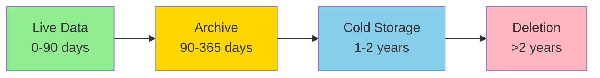

# Operations Guide

This guide covers the operational aspects of running the Airport Flight Data Collector in production, including automation, monitoring, maintenance, and optimization.

## Table of Contents
- [GitHub Actions Automation](#github-actions-automation)
- [Monitoring & Health Checks](#monitoring--health-checks)
- [Data Retention & Archival](#data-retention--archival)
- [Performance Optimization](#performance-optimization)
- [Backup & Recovery](#backup--recovery)
- [Docker Deployment](#docker-deployment)
- [Scaling Strategies](#scaling-strategies)
- [Maintenance Tasks](#maintenance-tasks)
- [Incident Response](#incident-response)

## GitHub Actions Automation

### Overview

The project includes multiple GitHub Actions workflows for automated data collection and maintenance:

```
.github/workflows/
├── collect-flight-data.yml      # Original file-based collection
├── collect-flight-data-db.yml   # Database-based collection
├── database-migration.yml       # Data migration workflow
├── health-check.yml            # System health monitoring
└── data-retention.yml          # Automated cleanup
```

### Setting Up Automated Collection

#### Step 1: Fork the Repository
```bash
# Fork on GitHub, then clone
git clone https://github.com/YOUR_USERNAME/airport-flight-data-collector.git
cd airport-flight-data-collector
```

#### Step 2: Configure GitHub Secrets

Go to Settings → Secrets and variables → Actions

**Essential Secrets:**
```yaml
# Database Provider (local, cloudflare, or oci)
DB_PROVIDER: cloudflare

# For GitHub commits (if using file storage)
PAT_GITHUB: your_personal_access_token

# For Cloudflare D1
CF_ACCOUNT_ID: your_account_id
CF_DATABASE_ID: your_database_id  
CF_API_TOKEN: your_api_token

# For Oracle Cloud
OCI_USER: your_username
OCI_PASSWORD: your_password
OCI_CONNECTION_STRING: your_connection_string
OCI_WALLET_BASE64: base64_encoded_wallet
```

#### Step 3: Enable Workflows

1. Go to Actions tab
2. Enable workflows
3. Verify scheduled runs

### Workflow Schedules

Default schedules (UTC):
```yaml
# Daily collection - 6 AM UTC
- cron: '0 6 * * *'

# Health check - Every 6 hours
- cron: '0 */6 * * *'

# Data retention - Weekly on Sunday
- cron: '0 0 * * 0'
```

Adjust for your timezone:
```yaml
# 6 AM EST (11 AM UTC)
- cron: '0 11 * * *'

# 6 AM PST (2 PM UTC)  
- cron: '0 14 * * *'
```

### Manual Workflow Runs

#### Collect Flight Data
1. Actions → "Collect Flight Data (Database)"
2. Click "Run workflow"
3. Options:
   - Airport: all, yyz, sfo, yvr
   - Provider override: local, cloudflare, oci

#### Database Migration
1. Actions → "Database Migration"
2. Options:
   - Migration type: test, recent-only, full
   - Specific airport or year

### Custom Workflows

Create your own workflow:

```yaml
name: Custom Collection
on:
  schedule:
    - cron: '0 12 * * *'  # Noon daily
  workflow_dispatch:
    inputs:
      airports:
        description: 'Airports to collect (comma-separated)'
        default: 'SFO,YYZ'

jobs:
  collect:
    runs-on: ubuntu-latest
    steps:
      - uses: actions/checkout@v3
      
      - name: Setup Node.js
        uses: actions/setup-node@v3
        with:
          node-version: '18'
          
      - name: Install dependencies
        run: npm ci
        
      - name: Collect data
        env:
          DB_PROVIDER: ${{ secrets.DB_PROVIDER }}
          CF_ACCOUNT_ID: ${{ secrets.CF_ACCOUNT_ID }}
          # ... other secrets
        run: |
          IFS=',' read -ra AIRPORTS <<< "${{ github.event.inputs.airports }}"
          for airport in "${AIRPORTS[@]}"; do
            npm run collect:${airport,,}
          done
```

## Monitoring & Health Checks

### Built-in Health Check System

#### HTTP Health Endpoint
```bash
# Start health check server
node scripts/health-check.js

# Default port: 3000
# Endpoint: http://localhost:3000/health
```

Response format:
```json
{
  "status": "healthy",
  "timestamp": "2025-07-26T10:30:00Z",
  "database": {
    "connected": true,
    "provider": "cloudflare",
    "environment": "production",
    "tables": {
      "flights": "airport_flight_data_prod_flights",
      "status": "airport_flight_data_prod_flight_status_history"
    }
  },
  "storage": {
    "type": "cloudflare",
    "available": true,
    "usage": {
      "used": "2.3GB",
      "limit": "5GB",
      "percentage": 46
    }
  },
  "collectors": {
    "SFO": { "lastRun": "2025-07-26T06:00:00Z", "status": "success" },
    "YYZ": { "lastRun": "2025-07-26T06:05:00Z", "status": "success" },
    "YVR": { "lastRun": "2025-07-26T06:10:00Z", "status": "success" }
  }
}
```

#### Monitoring Script
```bash
# One-time check
node scripts/monitor.js --check-once

# Continuous monitoring
node scripts/monitor.js --interval 300  # Every 5 minutes

# With alerts
node scripts/monitor.js --alert-email ops@example.com
```

### Setting Up External Monitoring

#### Uptime Monitoring
Use services like:
- **UptimeRobot**: Free tier available
- **Pingdom**: More features
- **StatusCake**: Good free tier

Configuration:
```yaml
Monitor Type: HTTP(s)
URL: https://your-domain.com/health
Method: GET
Expected Status: 200
Expected Content: "healthy"
Alert Contacts: your-email@example.com
```

#### CloudWatch (for AWS deployments)
```javascript
// CloudWatch integration
const AWS = require('aws-sdk');
const cloudwatch = new AWS.CloudWatch();

async function putMetric(name, value, unit = 'Count') {
  await cloudwatch.putMetricData({
    Namespace: 'AirportFlightCollector',
    MetricData: [{
      MetricName: name,
      Value: value,
      Unit: unit,
      Timestamp: new Date()
    }]
  }).promise();
}

// Usage
await putMetric('FlightsCollected', flightCount);
await putMetric('CollectionDuration', duration, 'Milliseconds');
```

### Alerting Rules

#### Critical Alerts
- Database connection failure
- Storage quota > 90%
- Collection failures > 3 consecutive
- API rate limit exceeded

#### Warning Alerts
- Storage quota > 75%
- Collection time > 5 minutes
- Partial data collection
- High error rate

#### Alert Configuration
```javascript
// alerts.config.js
module.exports = {
  critical: {
    database_down: {
      condition: 'database.connected === false',
      message: 'Database connection lost',
      channels: ['email', 'sms', 'slack']
    },
    storage_critical: {
      condition: 'storage.percentage > 90',
      message: 'Storage critically low',
      channels: ['email', 'slack']
    }
  },
  warning: {
    collection_slow: {
      condition: 'collection.duration > 300000',
      message: 'Collection taking too long',
      channels: ['email']
    }
  }
};
```

## Data Retention & Archival

### Retention Policies

#### Default Policy
```javascript
// retention-policy.js
module.exports = {
  // Keep recent data in hot storage
  hot_storage_days: 90,
  
  // Archive to cold storage
  cold_storage_days: 365,
  
  // Delete after
  deletion_days: 730, // 2 years
  
  // Exceptions
  preserve: {
    // Always keep first day of month
    first_of_month: true,
    // Keep data from significant events
    special_dates: ['2020-03-15', '2021-01-06']
  }
};
```

#### Running Retention Scripts

```bash
# Dry run - see what would be deleted
node scripts/data-retention.js --dry-run

# Archive old data
node scripts/data-retention.js --archive

# Delete archived data
node scripts/data-retention.js --delete-archived

# Custom retention period
node scripts/data-retention.js --days 180
```

### Archival Strategies

#### S3 Cold Storage
```javascript
// Archive to S3 Glacier
const archiveToS3 = async (data, key) => {
  await s3.putObject({
    Bucket: 'flight-data-archive',
    Key: key,
    Body: JSON.stringify(data),
    StorageClass: 'GLACIER'
  }).promise();
};
```

#### Compressed Archives
```bash
# Monthly archives
tar -czf archive-2025-01.tar.gz data/*/2025-01-*.json

# Upload to cloud storage
aws s3 cp archive-2025-01.tar.gz s3://backups/
```

### Data Lifecycle Management



## Performance Optimization

### Database Optimization

#### Index Strategy
```sql
-- Essential indexes for Cloudflare D1
CREATE INDEX idx_flights_lookup 
ON flights(airport_code, collection_date);

CREATE INDEX idx_flights_status 
ON flights(flight_status, collection_date);

-- Composite index for common queries
CREATE INDEX idx_flights_search 
ON flights(airport_code, flight_status, collection_date);

-- Oracle advanced indexing
CREATE INDEX idx_json_airline 
ON flights(JSON_VALUE(data, '$.airline'));
```

#### Query Optimization
```javascript
// Bad - N+1 queries
for (const date of dates) {
  const flights = await db.query(
    'SELECT * FROM flights WHERE date = ?', 
    [date]
  );
}

// Good - Single query
const flights = await db.query(
  'SELECT * FROM flights WHERE date IN (?)',
  [dates]
);
```

### Collection Optimization

#### Parallel Processing
```javascript
// Collect from multiple airports concurrently
const results = await Promise.allSettled([
  collectSFO(),
  collectYYZ(),
  collectYVR()
]);

// Process results
results.forEach((result, index) => {
  if (result.status === 'fulfilled') {
    console.log(`Airport ${index} success:`, result.value);
  } else {
    console.error(`Airport ${index} failed:`, result.reason);
  }
});
```

#### Connection Pooling
```javascript
// Oracle connection pool configuration
const poolConfig = {
  user: process.env.OCI_USER,
  password: process.env.OCI_PASSWORD,
  connectionString: process.env.OCI_CONNECTION_STRING,
  poolMin: 2,
  poolMax: 10,
  poolIncrement: 2,
  poolTimeout: 60,
  queueTimeout: 60000
};
```

#### Caching Strategy
```javascript
// In-memory cache for frequently accessed data
const cache = new NodeCache({ 
  stdTTL: 600, // 10 minutes
  checkperiod: 120 
});

// Cache wrapper
async function getCachedData(key, fetchFn) {
  let data = cache.get(key);
  if (!data) {
    data = await fetchFn();
    cache.set(key, data);
  }
  return data;
}
```

### Resource Management

#### Memory Optimization
```javascript
// Stream large datasets
const stream = db.queryStream('SELECT * FROM flights');

stream.on('data', (row) => {
  // Process row by row
  processFlightData(row);
});

stream.on('end', () => {
  console.log('Processing complete');
});
```

#### CPU Optimization
```javascript
// Use worker threads for CPU-intensive tasks
const { Worker } = require('worker_threads');

function processInWorker(data) {
  return new Promise((resolve, reject) => {
    const worker = new Worker('./processor.js', {
      workerData: data
    });
    
    worker.on('message', resolve);
    worker.on('error', reject);
  });
}
```

## Backup & Recovery

### Automated Backups

#### Daily Backup Workflow
```yaml
name: Daily Backup
on:
  schedule:
    - cron: '0 2 * * *'  # 2 AM UTC daily

jobs:
  backup:
    runs-on: ubuntu-latest
    steps:
      - name: Export database
        run: |
          node scripts/backup.js \
            --provider ${{ secrets.DB_PROVIDER }} \
            --output backup-$(date +%Y%m%d).json
            
      - name: Upload to S3
        uses: jakejarvis/s3-sync-action@v0.5.1
        with:
          args: --storage-class GLACIER
        env:
          AWS_S3_BUCKET: flight-data-backups
          SOURCE_DIR: ./backups
```

#### Backup Verification
```javascript
// verify-backup.js
async function verifyBackup(backupFile) {
  const backup = JSON.parse(fs.readFileSync(backupFile));
  
  // Check data integrity
  const checks = {
    hasData: backup.flights && backup.flights.length > 0,
    hasMetadata: backup.metadata && backup.metadata.timestamp,
    validDates: backup.flights.every(f => isValidDate(f.date)),
    validAirports: backup.flights.every(f => 
      ['SFO', 'YYZ', 'YVR'].includes(f.airport)
    )
  };
  
  return Object.values(checks).every(check => check === true);
}
```

### Recovery Procedures

#### Point-in-Time Recovery
```bash
# Restore from specific date
node scripts/restore.js --date 2025-07-20

# Restore specific airport
node scripts/restore.js --airport SFO --date 2025-07-20

# Test restore without applying
node scripts/restore.js --date 2025-07-20 --dry-run
```

#### Disaster Recovery Plan

1. **Data Loss Detection**
   ```bash
   node scripts/verify-data-integrity.js
   ```

2. **Identify Last Good Backup**
   ```bash
   node scripts/list-backups.js --valid-only
   ```

3. **Restore Process**
   ```bash
   # Stop collection
   npm run stop-collection
   
   # Restore from backup
   node scripts/restore.js --backup backup-20250720.json
   
   # Verify restoration
   node scripts/verify-data-integrity.js
   
   # Resume collection
   npm run start-collection
   ```

4. **Post-Recovery Validation**
   ```bash
   # Check data continuity
   node scripts/check-gaps.js --days 30
   
   # Verify counts match
   node scripts/compare-counts.js --before --after
   ```

## Docker Deployment

### Overview

The project provides comprehensive Docker support for containerized deployments. This enables consistent environments, easy scaling, and simplified operations.

For detailed Docker setup and configuration, see the [Docker Guide](docker-guide.md).

### Quick Start with Docker Compose

```bash
# Clone repository
git clone https://github.com/yourusername/airport-flight-data-collector.git
cd airport-flight-data-collector

# Configure environment
cp .env.example .env
# Edit .env with your database credentials

# Start all services
docker-compose up -d

# Check status
docker-compose ps
docker-compose logs -f
```

Services available:
- API: http://localhost:3001
- Dashboard: http://localhost:3000
- Grafana: http://localhost:3003

### Production Docker Deployment

#### 1. Use Production Compose File

```yaml
# docker-compose.prod.yml
version: '3.8'

services:
  api:
    restart: always
    deploy:
      resources:
        limits:
          memory: 512M
    logging:
      driver: json-file
      options:
        max-size: "10m"
        max-file: "3"
```

```bash
docker-compose -f docker-compose.yml -f docker-compose.prod.yml up -d
```

#### 2. Enable HTTPS with Traefik

```yaml
services:
  traefik:
    image: traefik:v2.10
    command:
      - "--providers.docker=true"
      - "--entrypoints.websecure.address=:443"
      - "--certificatesresolvers.myresolver.acme.email=your@email.com"
    ports:
      - "443:443"
    volumes:
      - "/var/run/docker.sock:/var/run/docker.sock:ro"
      - "./letsencrypt:/letsencrypt"

  api:
    labels:
      - "traefik.enable=true"
      - "traefik.http.routers.api.rule=Host(`api.yourdomain.com`)"
      - "traefik.http.routers.api.tls=true"
      - "traefik.http.routers.api.tls.certresolver=myresolver"
```

#### 3. Container Orchestration

For Kubernetes deployment:

```yaml
# k8s/deployment.yaml
apiVersion: apps/v1
kind: Deployment
metadata:
  name: flight-collector-api
spec:
  replicas: 3
  selector:
    matchLabels:
      app: flight-collector-api
  template:
    metadata:
      labels:
        app: flight-collector-api
    spec:
      containers:
      - name: api
        image: flight-collector-api:latest
        ports:
        - containerPort: 3001
        env:
        - name: DATABASE_TYPE
          valueFrom:
            secretKeyRef:
              name: flight-collector-secrets
              key: database-type
```

### Docker Monitoring

Monitor container health and resource usage:

```bash
# Real-time stats
docker stats

# Container health
docker inspect flight-collector-api | jq '.[0].State.Health'

# Prometheus metrics
curl http://localhost:3001/metrics
```

### Docker Maintenance

```bash
# Update images
git pull
docker-compose build --no-cache
docker-compose up -d

# Clean up
docker system prune -a --volumes

# Backup volumes
docker run --rm \
  -v flight-data:/data \
  -v $(pwd)/backups:/backup \
  alpine tar czf /backup/data-$(date +%Y%m%d).tar.gz /data
```

## Scaling Strategies

### Horizontal Scaling

#### Multi-Region Deployment
```javascript
// Deploy collectors in multiple regions
const regions = {
  'us-west': ['SFO', 'LAX', 'SEA'],
  'us-east': ['JFK', 'BOS', 'ATL'],
  'europe': ['LHR', 'CDG', 'FRA']
};

// Regional collector assignment
function getCollectorRegion(airport) {
  for (const [region, airports] of Object.entries(regions)) {
    if (airports.includes(airport)) {
      return region;
    }
  }
  return 'default';
}
```

#### Load Balancing
```nginx
# Nginx configuration for multiple collectors
upstream collectors {
    server collector1.example.com:3000;
    server collector2.example.com:3000;
    server collector3.example.com:3000;
}

server {
    location /collect {
        proxy_pass http://collectors;
        proxy_next_upstream error timeout;
    }
}
```

### Vertical Scaling

#### Resource Allocation
```yaml
# GitHub Actions runner configuration
jobs:
  collect:
    runs-on: ubuntu-latest
    strategy:
      matrix:
        airport: [SFO, YYZ, YVR, LAX, ORD]
      max-parallel: 3  # Limit concurrent jobs
```

#### Database Scaling

**Cloudflare D1:**
```javascript
// Implement read replicas
const readDB = new D1Database(readOnlyCredentials);
const writeDB = new D1Database(readWriteCredentials);

// Route queries appropriately
async function query(sql, params, options = {}) {
  const db = options.write ? writeDB : readDB;
  return db.prepare(sql).bind(...params).all();
}
```

**Oracle Cloud:**
```sql
-- Enable auto-scaling
ALTER DATABASE SET AUTO_SCALING = TRUE;
ALTER DATABASE SET CPU_COUNT = 4;
```

## Maintenance Tasks

### Regular Maintenance Schedule

#### Daily Tasks
- Monitor collection success rate
- Check storage usage
- Verify data integrity
- Review error logs

#### Weekly Tasks
- Run data retention cleanup
- Update collection statistics
- Check for API changes
- Review performance metrics

#### Monthly Tasks
- Full backup verification
- Security audit
- Dependency updates
- Performance optimization

### Maintenance Scripts

#### Update Dependencies
```bash
#!/bin/bash
# update-deps.sh

echo "Checking for updates..."
npm outdated

echo "Updating dependencies..."
npm update

echo "Running tests..."
npm test

echo "Checking for vulnerabilities..."
npm audit

if [ $? -eq 0 ]; then
    echo "✅ Updates complete"
else
    echo "❌ Issues found, review before deploying"
fi
```

#### Database Maintenance
```javascript
// maintenance.js
async function runMaintenance() {
  console.log('Starting maintenance...');
  
  // Vacuum database (SQLite/D1)
  await db.exec('VACUUM');
  
  // Update statistics
  await db.exec('ANALYZE');
  
  // Check integrity
  const integrity = await db.all('PRAGMA integrity_check');
  
  // Optimize indexes
  await optimizeIndexes();
  
  console.log('Maintenance complete');
}
```

### Health Checks

#### System Health Dashboard
```javascript
// health-dashboard.js
const express = require('express');
const app = express();

app.get('/dashboard', async (req, res) => {
  const health = await getSystemHealth();
  
  res.send(`
    <html>
      <head>
        <title>Flight Collector Health</title>
        <meta http-equiv="refresh" content="30">
      </head>
      <body>
        <h1>System Health Dashboard</h1>
        <h2>Status: ${health.status}</h2>
        <ul>
          <li>Database: ${health.database.status}</li>
          <li>Storage: ${health.storage.used}/${health.storage.total}</li>
          <li>Last Collection: ${health.lastCollection}</li>
          <li>Error Rate: ${health.errorRate}%</li>
        </ul>
      </body>
    </html>
  `);
});

app.listen(3001);
```

## Incident Response

### Incident Classification

#### Severity Levels
- **P1 (Critical)**: Complete system failure
- **P2 (High)**: Partial data loss or major degradation
- **P3 (Medium)**: Single airport failure
- **P4 (Low)**: Minor issues, warnings

### Response Procedures

#### P1 - Critical Incident
```markdown
1. **Immediate Actions** (0-15 min)
   - Acknowledge alert
   - Assess impact
   - Notify stakeholders
   - Begin diagnosis

2. **Mitigation** (15-60 min)
   - Switch to backup system
   - Stop problematic collectors
   - Implement temporary fix

3. **Resolution** (1-4 hours)
   - Identify root cause
   - Implement permanent fix
   - Test thoroughly
   - Deploy fix

4. **Post-Incident** (Next day)
   - Write incident report
   - Update runbooks
   - Implement preventive measures
```

#### Common Issues & Solutions

**API Changes:**
```javascript
// Quick fix for API changes
const API_VERSIONS = {
  'v1': 'https://old-api.example.com',
  'v2': 'https://new-api.example.com'
};

// Fallback mechanism
async function fetchWithFallback(airport) {
  try {
    return await fetchFromAPI('v2', airport);
  } catch (error) {
    console.warn('V2 API failed, falling back to V1');
    return await fetchFromAPI('v1', airport);
  }
}
```

**Rate Limiting:**
```javascript
// Adaptive rate limiting
const rateLimiter = {
  delays: { initial: 1000, current: 1000, max: 60000 },
  
  async throttle() {
    await sleep(this.delays.current);
  },
  
  backoff() {
    this.delays.current = Math.min(
      this.delays.current * 2,
      this.delays.max
    );
  },
  
  reset() {
    this.delays.current = this.delays.initial;
  }
};
```

### Runbooks

#### Collection Failure Runbook
```markdown
## Symptoms
- No new data in database
- Error in GitHub Actions logs
- Health check failing

## Diagnosis
1. Check GitHub Actions log
2. Verify credentials are valid
3. Test API manually
4. Check database connection

## Resolution Steps
1. If API changed:
   - Update collector code
   - Test locally
   - Deploy fix

2. If credentials expired:
   - Regenerate credentials
   - Update GitHub Secrets
   - Re-run workflow

3. If database full:
   - Run retention cleanup
   - Archive old data
   - Increase storage
```

### Communication Templates

#### Incident Notification
```markdown
Subject: [P1] Flight Data Collection System Down

Status: Investigating
Impact: No flight data being collected
Started: 2025-07-26 10:30 UTC

We are currently investigating an issue with the flight data collection system. Collection from all airports is currently failing.

Next Update: In 30 minutes or when resolved
```

#### Resolution Notice
```markdown
Subject: [RESOLVED] Flight Data Collection System

Status: Resolved
Duration: 2 hours 15 minutes
Root Cause: API rate limit exceeded

The issue has been resolved. Collection has resumed normally. 
Missing data from the outage period will be backfilled.

Actions Taken:
- Implemented exponential backoff
- Increased delay between requests
- Added rate limit monitoring

Preventive Measures:
- Deploy rate limit warnings at 80%
- Implement request queuing
- Add fallback collection schedule
```

## Operational Best Practices

### Documentation
- Keep runbooks updated
- Document all configuration changes
- Maintain architecture diagrams
- Track known issues

### Monitoring
- Set up comprehensive alerting
- Monitor trends, not just thresholds
- Regular health check reviews
- Capacity planning

### Security
- Regular credential rotation
- Audit access logs
- Keep dependencies updated
- Security scanning in CI/CD

### Performance
- Regular performance reviews
- Optimize slow queries
- Cache where appropriate
- Load test new changes

### Communication
- Clear escalation paths
- Regular status updates
- Post-incident reviews
- Stakeholder updates

## Support & Resources

### Internal Resources
- Runbooks: `/docs/runbooks/`
- Scripts: `/scripts/`
- Monitoring: `/monitoring/`

### External Resources
- [GitHub Actions Docs](https://docs.github.com/actions)
- [Cloudflare D1 Operations](https://developers.cloudflare.com/d1/operations/)
- [Oracle Cloud Operations](https://docs.oracle.com/en-us/iaas/operations-guide/)

### Contact
- Issues: GitHub Issues
- Urgent: On-call rotation
- Questions: Team chat channel